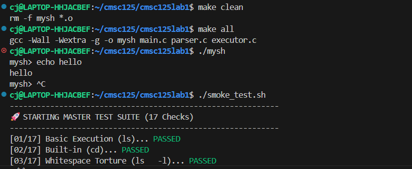
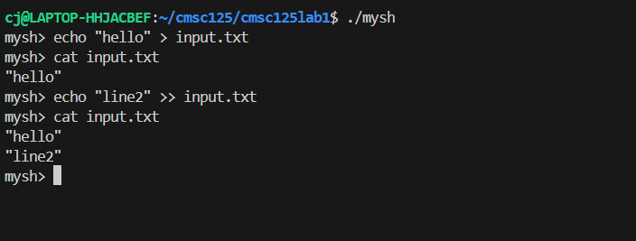

# CMSC 125 Lab 1: Unix Shell (mysh)

**Course:** CMSC 125 – Operating Systems  
**Instructor:** Rene Jocsing  

## Group Members
- Christian Joseph Hernia
- Julo Bretana

## Overview
`mysh` is a custom Unix command-line interpreter written in C. The project demonstrates core operating system concepts such as process creation (`fork`/`exec`), file descriptor manipulation (`dup2`), and signal handling. It parses user input, manages child processes, and handles file I/O redirection using the POSIX API.

## Task Requirements
Build a Unix shell (`mysh`) that supports:
- Interactive command execution with a prompt
- Built-in commands: `exit`, `cd`, `pwd`
- External command execution via `fork()` and `exec()`
- I/O redirection: `>` (truncate), `>>` (append), `<` (input)
- Background execution: `&`

---

## Compilation and Usage

### Compile
```bash
make
```

### Run
```bash
./mysh
```

### Clean
```bash
make clean
```

---

## Usage Examples
```bash
mysh> ls -l > output.txt      # Redirect output to file
mysh> grep "code" < main.c    # Read input from file
mysh> sleep 5 &               # Run in background
[job 12345] 12345
mysh> cd /tmp                 # Change directory
```

---

## Implemented Features

- **Interactive Command Loop**  
  Continuous REPL that displays a `mysh>` prompt and reads user commands.

- **Built-in Commands**
  - `exit`: Terminates the shell and cleans up background jobs using `SIGTERM`.
  - `cd`: Changes current directory using `chdir()`.
  - `pwd`: Prints the working directory via `getcwd()`.

- **External Command Execution**  
  Spawns child processes with `fork()` and runs commands using `execvp()`.

- **I/O Redirection**
  - `>`: Redirects output to a file (truncate mode)
  - `>>`: Redirects output to a file (append mode)
  - `<`: Redirects input from a file

- **Background Execution**
  - Runs commands asynchronously with `&`
  - **Zombie prevention:** uses `waitpid()` with `WNOHANG` at the start of each loop iteration

---

## Design Decisions and Architecture Overview

- **Modular Architecture**  
  The system is divided into:
  - `main.c` (REPL/loop)
  - `parser.c` (tokenization)
  - `executor.c` (syscall logic)  
  This separation improves readability and maintainability.

- **Caller-Allocated Memory**  
  The `Command` struct is stack-allocated in `main.c` and reset via `memset` every iteration to avoid heap leaks.

- **Non-Blocking Reaper**  
  Uses `WNOHANG` polling to reap background processes without freezing the shell.

- **File Descriptor Hygiene**  
  Child processes close original file descriptors immediately after `dup2()` to prevent leaks.

---

## Known Limitations / Bugs
- **Piping:** The pipe operator (`|`) is not supported.  
- **Command History:** Arrow-key navigation is not implemented.  
- **String Quoting:** Quoted arguments (e.g., `echo "hello world"`) are not handled as a single token.

---

## Screenshots

1. **Compilation and Basic Commands**  
   

2. **Redirection and Background Processing**  
   